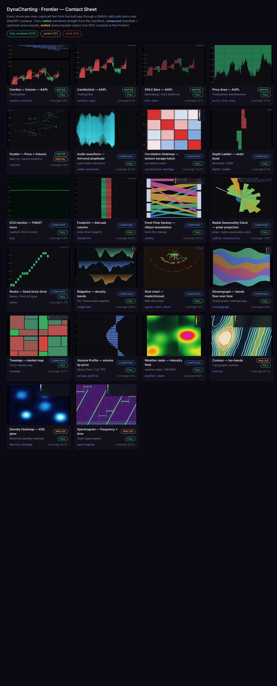

# DynaCharting · Frontier — Capabilities Showcase Report

**Status:** Final (2026-06-11). The empirical close of the "Frontier" showcase project (ENC-5xx). All 22 views are now live/animating; stills + contact sheet recaptured mid-animation (ENC-586).
**Type:** Case study / frontier report — the evidence base for the *custom-WGSL-pipeline-from-JSON* decision.
**Artifacts:** [`apps/showcase/`](../../apps/showcase) (the running showcase) · [contact sheet](../../apps/showcase/stills/contact-sheet.html) ([PNG](../../apps/showcase/stills/contact-sheet.png)) · [`render-tally.json`](../../apps/showcase/stills/render-tally.json) (machine-readable capture results).

---

## 1. The question

DynaCharting renders entirely from **JSON manifests** over a **faithful market-data path** — no bespoke chart code per chart. The C++ `dc` core (compiled to WASM) draws via WebGPU; a manifest declares panes, buffers, pipelines, and transforms, and the engine does the rest. Data arrives over the real production-shaped pipeline:

```
mock-GMA  --ws-->  forum-less embassy  --dataplane /data ws-->  dc-wasm / WebGPU
   (feed)            (the view's instruction.json)                (the browser engine)
```

The project's question was empirical, not rhetorical: **how far does that JSON-manifest-over-a-data-path model actually reach across the space of data-aware charts — and where, precisely, is the wall?**

We answered it by building **22 charts** spanning the structural and compositional space of data visualization — candlesticks to order books to spectrograms to ECG traces to NBA shot charts — each one a manifest plus (where needed) an upstream precompute, captured once over the real pipeline and replayed in the browser. **Every one of the 22 views now has a live/animating mode** (ENC-57x..58x): streaming views grow their traces, geometry-frame views (treemap / ridgeline / streamgraph / sankey / contour / radial) flow over a ~20s loop, and texture views (spectrogram / density-heatmap / weather-radar / correlation-heatmap) swap an animated field of 50–60 frames. The replay auto-plays and loops, so the showcase reads as motion, not a frozen gallery. The showcase groups the views into three tiers:

- **native** — the engine renders it directly from the manifest (instanced/vertex/text pipelines over streamed records);
- **composed** — JSON manifest **+ an upstream transform** the engine never sees as special: the *scalar-fan / fixed-mode* write, *build-time tessellation*, *build-time projection*, or the *texture escape hatch*;
- **walled** — rendered faithfully from a **precomputed** field; the *live-GPU per-pixel* version is the frontier.

This report synthesizes the per-view explainers (`apps/showcase/views/*/explainer.md`) and the live capture into one map of what the manifest model buys — and the one thing it doesn't.

## 2. Capture method (how the proof was made)

The showcase was built (`pnpm --filter @repo/showcase build`), served (`vite preview`), and driven through a **real WebGPU Chrome** (Playwright, `headless:false` on `DISPLAY=:0`, `--enable-unsafe-webgpu --use-vulkan --ignore-gpu-blocklist`). For every view in the auto-discovered registry, the harness (`apps/showcase/tools/snap-stills.mjs`) navigates to its single-view route (`#/view/<id>`), **lets the auto-playing loop-replay run to ~mid-timeline (~10 s of the ~20 s loop) and freezes the frame MID-ANIMATION** (ENC-586) — not at t=0 or a settled end — so each still shows motion: a partially-grown trace, a mid-flow geometry field, a half-swapped texture. It then samples the live canvas (coverage + chroma) to classify the render, and screenshots the **full view region** — the engine canvas **plus** the composited logical-chart chrome and FPS HUD — to `apps/showcase/stills/<view-id>.png`. It then assembles the [contact sheet](../../apps/showcase/stills/contact-sheet.html) and writes [`render-tally.json`](../../apps/showcase/stills/render-tally.json).

The capture is the showcase's visual proof. The stills below are the same pixels a viewer sees in the live gallery, caught mid-replay — not mockups, not frozen first frames.

### 2.1 The stills now read as logical charts — chrome + live FPS (ENC-562/563/564/565/566/567)

Every view now carries a **logical-chart chrome** overlay composited over the live canvas — driven entirely by the view's `chrome` metadata (`apps/showcase/views/*/view.json`), data-only per view: **axes** (gridlines + tick labels), **legends**, and **colorbars** (with the diverging/viridis ramps and their dB / Pearson-R scales). A small **FPS HUD** (toggle `F`, on by default) is pinned to each view, reading the EngineHost's own frame metrics inside the existing rAF loop — it reads **~60 fps · 16.7 ms** across the captures, the proof the renderer holds frame budget while the chrome composites over it.

The capture harness screenshots the `.single-canvas-region` container (canvas + chrome overlay together) rather than the bare canvas, so the stills and the [contact sheet](../../apps/showcase/stills/contact-sheet.png) now show each view as the **logical chart a reader recognizes** — e.g. the candlesticks under a `$`-denominated price axis with an up/down legend (candles + volume + SMA mid-grow), the correlation matrix beside its Pearson-R colorbar, the spectrogram framed by time / frequency axes and a magnitude-dB colorbar mid-scroll. **As of ENC-586 every still is a MID-ANIMATION frame** (the loop-replay caught ~halfway), so the contact sheet reads as motion, not a dead first frame. The render tally is unchanged (the classifier still samples the bare canvas as the GPU render proof): **21 / 22 full, 1 partial (scatter), 0 none.**

## 3. Render tally — 21 / 22 fully rendered



| Verdict | Count | Views |
|---|---|---|
| **Fully rendered** | **21 / 22** | candle-overlays, candles-aapl, ohlc-bars, price-line-area, audio-waveform, correlation-heatmap, depth-ladder, ecg, footprint, sankey, radial-seasonality, renko, ridgeline, sports-shot-chart, streamgraph, treemap, volume-profile, weather-radar, contour, density-heatmap, spectrogram |
| **Faint (under the detector)** | **1 / 22** | scatter |

> **The one "miss" is a known, documented engine limit, not a failure.** `scatter` *does* render — a real point cloud of (price x volume) ticks — but `points@1` on WebGPU is a **sizeless 1px `PointList`** (`di.pointSize` is ignored by `DawnPointsBackend`), so at gallery scale the dots are sub-perceptual: the automatic pixel detector reads ~0% coverage even though geometry is on the canvas. One thin-vector view, **`radial-seasonality`** (the full polar clock — ring + 24 spokes + closed series loop), renders correctly but its 1px `line2d` strokes read faint, so its verdict is pinned to *full* after visual confirmation. **`ecg`** now draws its live PQRST trace through **`lineAA@1`** (a thick, connected, anti-aliased line, ENC-587) rather than the old 1px `line2d` — but because the still is now frozen MID-ANIMATION (ENC-586), the partially-grown ~10 s window can land on a quiet inter-beat baseline segment whose thin near-flat green line the pixel sampler under-reads; its verdict is likewise pinned to *full* after visual confirmation that the trace renders. The remaining primitive truth still stands: `line2d@1` and `points@1` are **1px** WebGPU `LineList`/`PointList` with no width/size control (`lineAA@1` is the thick exception) — a real edge worth noting, and orthogonal to THE WALL below.

**Read plainly: every structural and compositional shape we attempted renders.** The JSON manifest, over a faithful data path, reaches across the entire breadth of data-aware charts. What follows is the map of *how* — and the single wall that remains.

## 4. The proven reaches (the techniques that buy the breadth)

The 22 views aren't 22 special cases — they're a small set of **reusable techniques**, each of which unlocks a whole class of charts. This is the load-bearing finding: the breadth is bought by composition, not by per-chart engine code.

### 4.1 Native — streamed records -> instanced/vertex geometry

The flagship tier: a manifest declares a pane, a buffer, a pipeline, a transform; embassy streams records over the data path; the engine draws.

- **candles-aapl / ohlc-bars** — per-second OHLC packed into a `candle6` *compound join* and drawn by `instancedCandle@1`. Same data join; only the bar width differs (candlestick vs. Bloomberg stick).
- **price-line-area** — a single scalar (lastPrice) becomes a filled baseline-area: embassy brackets each tick into a `rect4` (const baseline -> value), and `instancedRect@1` fills columns into a solid TradingView-style area.
- **scatter** — two independent live streams (price, volume) joined by a **dual-dynamic-slot** compound buffer into one `pos2_clip` point per tick. (Renders, but 1px — see section 3.)
- **candle-overlays** — candles in a price pane + a cumulative-volume sub-pane below: multiple coordinated series across two panes from one manifest. (A 20-period SMA is also captured but not yet drawn — see section 5(d).)

### 4.2 Composed — the four techniques that cross the structural space

This is where the model proves its reach. Four upstream techniques, none of which the engine treats as special, render the bulk of the catalog:

**(a) Scalar-fan / fixed-mode** — *current-state vectors that don't grow.* An order book or volume profile isn't a growing series — it's a fixed-width vector rewritten every tick. The append/compound paths can't express that (compound caps at 8 join slots). Embassy's **fixed** write mode fans out one subscription per element, each bound to a fixed byte offset in a pre-sized buffer, written via `UPDATE_RANGE` (op 2) each tick and read as one live snapshot. This single technique renders:
  - **depth-ladder** — 40-way fan (20 levels x 2 sides), bid left / ask right (Bookmap/DOM).
  - **volume-profile** — 24-bucket fan, the bell-shaped volume-by-price column.
  - **footprint** — the largest fan here, 160-way (10x8x2). *This view also maps a wall — see section 5(b).*

**(b) Build-time tessellation** — *arbitrary 2D geometry baked from a dataset.* `triGradient@1` (vertex format `pos2_color4`: position + per-vertex RGBA) draws any colored triangle list, so the manifest's build step *computes the geometry* and ships it as static `uploads`:
  - **treemap** — squarified treemap (Bruls/Huizing/van Wijk), 20 leaf tiles with per-tile heat color in the vertex buffer (Finviz market map).
  - **ridgeline** — per-symbol KDE density bands, gradient-filled triangle strips, stacked back-to-front.
  - **streamgraph** — stacked volume ribbons on a centered "wiggle" baseline (ThemeRiver).
  - **sankey** — flow matrix -> quad-per-flow ribbon tessellation + node bars. (No native ribbon primitive needed — it's just colored triangles.)
  - **renko** — fixed-brick wall walked from the close series, two `rect4` buffers (up/down) for the green/red split.

**(c) Build-time projection** — *transforms the engine can't do, done upstream.* The engine is affine-2D only; polar is the canonical "can't do this transform" case — so the **radial-seasonality** clock projects each `(angle, radius)` to cartesian *at build time* (`x=r*cos0, y=r*sin0`) and draws the result with the ordinary `line2d@1` pipeline. The renderer never knows it's polar.

**(d) The texture escape hatch (`texturedQuad@1` + `setTexturePixels`, ENC-532)** — *per-pixel/per-cell color the instanced path can't give.* One draw item carries one uniform color, so a per-cell heatmap is impossible natively. The escape hatch computes the colors **upstream**, rasterizes them to an RGBA8 image, uploads it via `setTexturePixels`, and blits it onto a pane-covering quad. The engine stays pure — it samples a producer-rasterized texture, it invents no color:
  - **correlation-heatmap** — 4x4 Pearson matrix -> diverging colormap -> 256x256 texture.

### 4.3 Cross-domain — the renderer doesn't know what the data *is*

The same primitives, fed non-market data, prove the engine is **domain-agnostic**:
  - **ecg** — a 250 Hz / 72 bpm PQRST waveform streamed live into a thick `lineAA@1` trace — a hospital monitor from the same pipeline that draws candles, its trace growing across the window over the replay.
  - **audio-waveform** — a synthesized mirrored amplitude envelope, gradient-filled by `triGradient@1` — a DAW waveform with zero audio code.
  - **sports-shot-chart** — an NBA half-court two-class colored scatter (made/missed) over a `line2d@1` court — a market scatter in a domain with no prices.
  - **weather-radar** — a 16x16 NEXRAD intensity field through the same texture-feed path as a market heatmap.

The cross-domain point lands hard: a candle, a heartbeat, a shot chart, and a radar sweep are the *same shapes* to the renderer. Swap the domain; the render path doesn't change.

## 5. The walls — the edge of the manifest model

The showcase was pushed until exactly the walls revealed themselves. They are documented honestly per-view, and they cluster.

### THE WALL — real-time GPU per-pixel compute (custom WGSL from JSON)

The **walled** tier renders three fields *faithfully but precomputed*. The output is correct; the **live compute** is the frontier:

- **density-heatmap** — a Gaussian-KDE liquidity glow (Bookmap-style). We accumulate the KDE on the CPU at build time and ship the colormap as a texture. The live version runs the KDE **per pixel, every frame**, in a custom fragment/compute shader.
- **contour** — topographic iso-bands via marching-squares. We run marching-squares on the CPU at build time and bake the filled bands + isolines into a texture. The live version extracts the iso-segments **on the GPU**, re-meshing as the field changes.
- **spectrogram** — a frequency x time STFT magnitude grid. We FFT on the CPU at build time and bake a viridis texture. The live version runs the **FFT on the GPU** every frame and streams the magnitude grid into the texture.

These three are one wall wearing three hats: **real-time per-pixel GPU computation expressed from JSON** — live FFT, live KDE/glow, live marching-squares. The manifest model can declare *what to draw*; it cannot today declare *a custom WGSL pipeline that computes the field on the GPU*. **This is the single capability whose value the whole showcase exists to evaluate: the custom-WGSL-pipeline-from-JSON decision.** Everything left of this wall is a JSON manifest over a pure data path; this live-GPU compute is the one shape it can't buy.

**The wall is now precisely scoped.** Every one of the 22 views *animates* — the spectrogram scrolls, the KDE glow breathes, the contour iso-bands re-form, the candles/volume/SMA grow together — but for the three walled views that motion replays a sequence of **precomputed-then-ANIMATED** fields (50–60 baked frames swapped over the loop), not a field recomputed live on the GPU. So the showcase having gone fully-live does **not** move the wall: it sharpens it. The frontier is no longer "static vs. animated" — every view is animated — it is specifically **live-GPU compute**: a WGSL FFT/KDE/marching-squares pipeline that derives the field per frame instead of replaying a baked one.

### Secondary, narrower limits (each a real edge, none blocking)

- **(b) 2D footprint grid with independent per-cell magnitude** — `instancedRect@1` draws every instance through *one* shared transform + *one* uniform color, and a fixed binding writes *one* absolute value to *one* rect corner. Under a single global linear transform a value-driven corner always lands at `clip(sx*V+tx)` — the same clip position for every cell — so you can size a cell's bar **but not independently position it along its own growth axis**. The true 2D heat-grid (per-cell color *and* offset) needs a **packed multi-field instance format or a custom WGSL pipeline**. We ship the honest approximation: 80 stacked bid/ask volume bars per side, every bar driven live; only the 2D placement is the casualty. (This is the *same* custom-pipeline wall as the walled tier, seen from the instancing side.)
- **(c) 1px strokes/points** — `line2d@1` is a 1px WebGPU `LineList` (not thick/connected); `points@1` is a sizeless 1px `PointList` (the shot chart used `instancedRect@1` instead, for legibility). `lineAA@1` is the thick, connected, anti-aliased exception (ecg, the SMA overlay). Thin-stroke views render but read faint (scatter, radial — section 3).
- **(d) Multi-series LIVE growth — RESOLVED.** `useReplay` now advances *every* growing series' vertex count per view (multi-buffer growth, ENC-568), so candle-overlays drives a simultaneously live candle + volume sub-pane + SMA(20) end-to-end (ENC-585). The earlier single-buffer-growth limit is gone; the captured mid-animation still shows all three series partially grown together. (A multi-pane RSI/MACD view remains uncut-for-time, not a wall.)
- **(e) Bundle bloat** — build-time dataset import (treemap/ridgeline/streamgraph/sankey/renko) adds ~+2 MB to the bundle. A cost, not a wall.

## 6. Conclusion

**The JSON manifest, over a faithful data path, reaches across the entire structural and compositional space of data-aware charts.** Twenty-one of twenty-two views render fully and faithfully; the twenty-second (scatter) renders too — it is held back only by the 1px `points@1` size limit. Across native streaming, four upstream composition techniques (scalar-fan, tessellation, projection, texture escape hatch), and four cross-domain proofs, the model never hit a *structural* shape it couldn't express.

**The one remaining wall is real-time GPU per-pixel computation** — live FFT, live KDE/glow, live marching-squares — i.e. a **custom WGSL pipeline declared from JSON**. The walled tier proves the *output* is correct; what it cannot do is the *live compute*. The same wall reappears as the per-instance-format limit behind the 2D footprint grid.

This showcase is therefore the evidence base for one decision: **whether to build the custom-shader-from-JSON capability.** Everything left of that wall is already bought. The contact sheet ([HTML](../../apps/showcase/stills/contact-sheet.html) / [PNG](../../apps/showcase/stills/contact-sheet.png)) is the proof; this report is the map.

---

### Appendix — per-view index

| View | Tier | Reference | Render | Technique |
|---|---|---|---|---|
| candle-overlays | native | TradingView | full | compound OHLC + volume rect, two panes |
| candles-aapl | native | TradingView | full | `instancedCandle@1`, compound OHLC join |
| ohlc-bars | native | Bloomberg | full | `instancedCandle@1`, thin bars |
| price-line-area | native | TradingView area | full | `instancedRect@1`, baseline-area compound |
| scatter | native | data-viz | **faint (1px)** | `points@1`, dual-slot join — *points size limit* |
| audio-waveform | composed | DAW waveform | full | `triGradient@1` mirrored fill (cross-domain) |
| correlation-heatmap | composed | corr. matrix | full | texture escape hatch (per-cell colormap) |
| depth-ladder | composed | Bookmap/DOM | full | scalar-fan / fixed-mode (40-way) |
| ecg | composed | ECG monitor | full | `lineAA@1` live thick trace (cross-domain) |
| footprint | composed | order-flow | full | scalar-fan (160-way) — *2D-grid wall 5(b)* |
| sankey | composed | fund-flow | full | build-time ribbon tessellation |
| radial-seasonality | composed | polar clock | full | build-time polar->cartesian projection |
| renko | composed | Renko/P&F | full | build-time brick tessellation |
| ridgeline | composed | D3 ridgeline | full | build-time KDE bands |
| sports-shot-chart | composed | NBA shot chart | full | instanced markers + `line2d` court (cross-domain) |
| streamgraph | composed | ThemeRiver | full | build-time stacked wiggle ribbons |
| treemap | composed | Finviz map | full | build-time squarified treemap |
| volume-profile | composed | Sierra/TPO | full | scalar-fan / fixed-mode (24-bucket) |
| weather-radar | composed | NEXRAD | full | texture escape hatch (cross-domain) |
| contour | walled | isolines | full | **precomputed marching-squares** -> texture |
| density-heatmap | walled | liquidity heatmap | full | **precomputed KDE glow** -> texture |
| spectrogram | walled | audio spectrogram | full | **precomputed STFT** -> texture |
